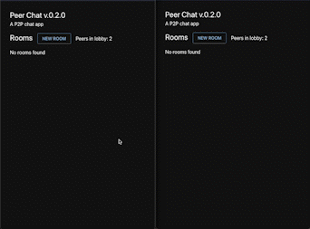
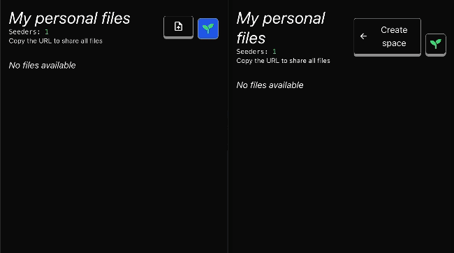
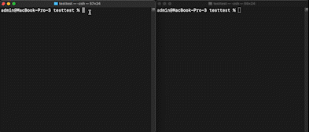

<br>
<p align="center">
    
</p>

<h1 align="center" style="border-bottom: none">
    <strong>
        Peerbit Example Library
        </strong>
</h1>

## Examples

### [Chat room](./packages/one-chat-room/)
[](./packages/one-chat-room/)


### [Lobby + chat rooms](./packages/many-chat-rooms/)
[](./packages/many-chat-rooms/)

### [Blog platform](./packages/blog-platform/)
[](./packages/blog-platform/)


### [Collaborative text document](./packages/text-document/)
[](./packages/text-document/)


### [Sync files](./packages/file-share/)
#### [React app](./packages/file-share/)
[](./packages/file-share/)
#### [CLI](./packages/file-share/)
[](./packages/file-share/)


### [Video streaming](./packages/media-streaming/video-streaming)
[](./packages/media-streaming/video-streaming/)


### [Collaborative machine learning](./packages/collaborative-learning/)
[](./packages/collaborative-learning/)

## Requirements

1. Node.js >= 22 (You can switch to Node 22 using `nvm use 22`)

## How to run the examples

1.
```sh
yarn
yarn build
```

2.
Go into an example. If it is a frontend app, you can run it locally (if you have a node running (see below)) with

```sh
yarn start
```

and remotely on a test relay

```sh
yarn start-remote
```

## How to setup a local relay node
(This is just a basic libp2p-js node)

1.
Install Node >= 16

2.
Install CLI
```sh
npm install -g @peerbit/server
```
3.
```sh
peerbit start
```

Ending with '&' to start a background process

For more complete instructions on how to run a node in a server center that can be accessed remotely [see this](https://github.com/dao-xyz/peerbit/tree/master/packages/clients/peerbit-server).
