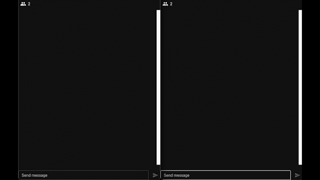
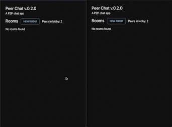
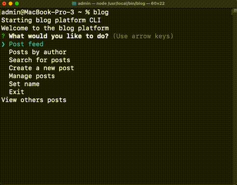

<br>
<p align="center">
    
</p>

<h1 align="center" style="border-bottom: none">
    <strong>
        Peerbit Example Library
        </strong>
</h1>

## Examples

### [Chat room](./packages/one-chat-room/)
[](./packages/one-chat-room/)


### [Lobby + chat rooms](./packages/many-chat-rooms/)
[](./packages/many-chat-rooms/)

### [Blog platform](./packages/blog-platform/)
[](./packages/blog-platform/)


### [Collaborative text document](./packages/text-document/)
[](./packages/text-document/)


### [Sync files](./packages/file-share/)
#### [React app](./packages/file-share/)
[](./packages/file-share/)
#### [CLI](./packages/file-share/)
[](./packages/file-share/)


### [Video streaming](./packages/media-streaming/video-streaming)
[](./packages/media-streaming/video-streaming/)


### [Collaborative machine learning](./packages/collaborative-learning/)
[](./packages/collaborative-learning/)

## Requirements

1. Node.js >= 22 (You can switch to Node 22 using `nvm use 22`)

## How to run the examples

1.
```sh
yarn
yarn build
```

2.
Go into an example. If it is a frontend app, you can run it locally (if you have a node running (see below)) with

```sh
yarn start
```

and remotely on a test relay

```sh
yarn start-remote
```

## How to setup a local relay node
(This is just a basic libp2p-js node)

1.
Install Node >= 16

2.
Install CLI
```sh
npm install -g @peerbit/server
```
3.
```sh
peerbit start
```

Ending with '&' to start a background process

For more complete instructions on how to run a node in a server center that can be accessed remotely [see this](https://github.com/dao-xyz/peerbit/tree/master/packages/clients/peerbit-server).

## Cloudflare hosting

The public frontends are hosted with Cloudflare Workers Static Assets, with a
selective cache Worker in front of the large MP4 fixtures that need byte-range
support.
`cloudflare/sites.json` is the source of truth for build directories and
expected titles. Worker identities and production hostnames must also match the
exact, deliberately duplicated allowlist in
`cloudflare/deployment-policy.json`. Updating a hostname or Worker therefore
requires an explicit deployment-policy review; merely adding another
`peerbit.org` subdomain to the site manifest is rejected.

Public preview deployment is disabled. Pull requests and `master` still build
every app, validate every asset, and dry-run every isolated preview Worker
bundle without a Cloudflare credential. Preview configs have no routes and
disable both `workers.dev` and version preview URLs, so Cloudflare account or
user slugs are never part of a public URL or workflow log. Production runtime
checks run inside the per-app transactional deploy and trigger rollback on
failure.

Preview validation uses no Cloudflare token. This is an authorization boundary,
not just a naming convention: preview CI cannot mutate any production Worker.
Production cutover uses a separately reviewed environment and credential.

Local validation uses the locked Wrangler toolchain:

```sh
pnpm install --frozen-lockfile
pnpm run build
node scripts/validate-production-bootstrap.mjs
node scripts/prepare-cloudflare-assets.mjs
npm ci --ignore-scripts --no-audit --no-fund --prefix tools/wrangler
node scripts/render-cloudflare-configs.mjs --mode preview
for config in .wrangler-config/*.jsonc; do
    tools/wrangler/node_modules/.bin/wrangler versions upload --config "$config" --dry-run
done
```

Production configs are rendered with `--mode production`. First-party demo
Workers are restricted to `*.apps.peerbit.org` and must exactly match the
deployment policy. Before any upload or promotion, production reads the
account's Worker route inventory and every page of its custom-domain inventory
with `Workers Scripts Read`. It accepts the custom-domain inventory only after
two independently read, canonical complete snapshots match. The account-wide
check requires every reviewed production Worker, including Workers outside a
targeted release, to have no traditional routes and exactly its reviewed custom
domain. It also reads each production Worker's live `workers.dev` and version
Preview URL state, plus that state for every existing allowlisted preview
Worker, and requires both flags to be disabled. It rejects retired Worker
identities, unreviewed ownership under `*.apps.peerbit.org`, and traditional
routes involving the managed namespace; unrelated account Workers and domains
remain outside this policy. The full read-only policy fence runs immediately
before and after every inactive upload. Wrangler output is captured rather than
echoed, and an unexpected `workers.dev` URL fails closed without exposing the
account subdomain. Production deploys capture every selected app's current 100%
version, release identity, and immutable Worker identity. They then upload every
new version without activating it, verify its per-invocation version tag, and
revalidate every baseline before promoting traffic. Exact versions are promoted
through Cloudflare's deployments API; that endpoint cannot alter routes or
custom domains. After every runtime check, all activated apps receive a final
exact version, version-tag, Worker-tag, public-subdomain, and attachment recheck.
If a later promotion or verification fails, earlier versions from the invocation
are unwound in reverse order only while each exact version, version tag, Worker
identity, and public attachment still match. After the rollback verifier, the
workflow repeats the full account policy and Worker-tag checks, then reads the
active deployment last before reporting success. Verification child processes
do not inherit the Cloudflare credential.

Cloudflare's deployments API does not currently expose an atomic
compare-and-swap precondition for the active version. The workflow revalidates
ownership immediately before every promotion and rollback and refuses
automatic recovery after an observed external change, but an external
deployment in the final interval between that read and Cloudflare accepting the
deployment POST cannot be eliminated client-side. Serialize production
deployments through the protected GitHub environment and inspect Cloudflare
manually if the workflow reports an ownership race.

The public-subdomain API has the same unavoidable last-read interval: an
external actor can enable `workers.dev` or Preview URLs after the final GET but
before Cloudflare accepts a version upload. The route-free upload config sets
both options to false, captured Wrangler output refuses to print an unexpected
Preview URL, and the workflow rereads live state immediately afterward, but
Cloudflare does not expose an atomic upload precondition for these settings.

A deployment POST can also be accepted even when Cloudflare returns an error or
an unusable response. Once Create Deployment has been dispatched, every
response failure—including 4xx/5xx responses, malformed or empty bodies, and
invalid exact-version success evidence—is therefore treated as indeterminate.
Local validation before dispatch remains determinate. The workflow observes a
bounded settlement window instead of trusting one baseline read, verifies the
baseline, reads it once more, and rolls back if this invocation's tagged version
appears. If it never appears during that window, the workflow still does not
declare the baseline safe, because the POST could land later. Automatic
recovery remains disabled and the workflow preserves both the primary and
recovery diagnostics for manual inspection.

A rollback POST has the same response and visibility ambiguity. Once it is
dispatched, a later read or verifier failure is reported as failed confirmation
of a possibly applied rollback, not as a refused rollback. Operators must inspect
the exact active version and public attachment state before retrying.

Cloudflare version rollback does not revert attached resources. Treat a change
to the exact hostname policy as a separate provisioning migration with its own
rollback plan; the routine release workflow is for code/assets on already
attached hostnames.

The transactional workflow intentionally refuses to create a Worker that has
no existing deployment, because there would be no version to restore. Seed a
new production Worker once under direct operator supervision, verify it, then
use the workflow for all later releases. Use the separately reviewed production
environment and retain a known-good Worker version.
