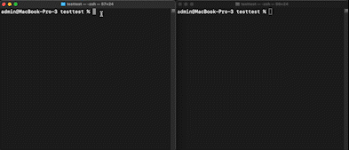

# File share app


An example how one can use a Document store to store files.


## CLI


There is a CLI application inside [./cli](./cli), that allows you to do the basic functionality.

Install from remote: 

```sh
npm install @peerbit/please
```

Now you can do 

```sh
please put FILE 
```

and 

```sh
please get HASH [OPTIONAL_SAVE_PATH]
```

e.g. 

```sh
please put test.txt 
```

```sh
please get test.txt ./some-folder
```


### Run CLI locally
To run it locally:

First go to the root folder of the exampels repo and build it

```
yarn build
```

Then go back to the [./cli](./cli) folder and now you can do: 

```node  ./cli/lib/esm/bin.js``` instead of ```please``` to invoke the cli. 

You can run through a local relay by passing a relay address using the `--relay` argument