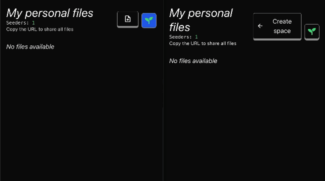
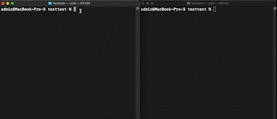

# File share app

An example how one can use a Document store to store files.

## Library
In the library folder you can find all code that is handling the file data.

## Frontend 


In the frontend folder you can find a React application using the library as a dependency.

Application is live at [files.dao.xyx](https://files.dao.xyz)


## CLI



There is a CLI application inside [./cli](./cli), that allows you to do the basic functionality.

By default the CLI stores its Peerbit state in `~/peerbit-file-share`, so uploaded files can be resumed from a persistent local directory. Pass `--directory null` if you want to run it in ephemeral mode instead.

Install from remote: 

```sh
npm install @peerbit/please
```

Now you can do 

```sh
please put FILE 
```

Keep the `please put ...` process running while you want to seed the file.

and 

```sh
please get HASH [OPTIONAL_SAVE_PATH]
```

e.g. 

```sh
please put test.txt 
```

```sh
please get HASH ./some-folder
```


### Run CLI locally
To run it locally:

First go to the root folder of the examples repo and build it

```
pnpm build
```

Then go back to the [./cli](./cli) folder and now you can do: 

```node  ./cli/lib/esm/bin.js``` instead of ```please``` to invoke the cli. 

You can dial a local peer by passing its address with `--peer`.
The older `--bootstrap` and `--relay` flags are still accepted as aliases, but the CLI now dials the peer directly and lets Peerbit discover shard roots automatically.
