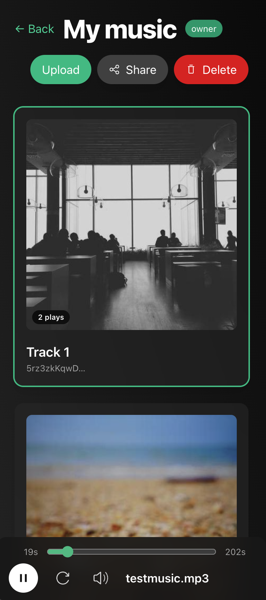

# Music library

This i a demo for a social music library. It allows you to share your music library with your friends and listen to their music. You can also create playlists and share them with your friends.

[](./image.png)

## Test locally

1. Install peerbit cli to run a local relay node
```sh
npm install -g @peerbit/server
```
2. Start a local relay node
```sh
peerbit start
```

3. Run the example

Install dependencies. In the root of the repo, run:
```sh
yarn
```

In the frontend folder, run:
```sh
yarn start
```

4. Open the app in your browser
```sh
open http://localhost:5173
```

